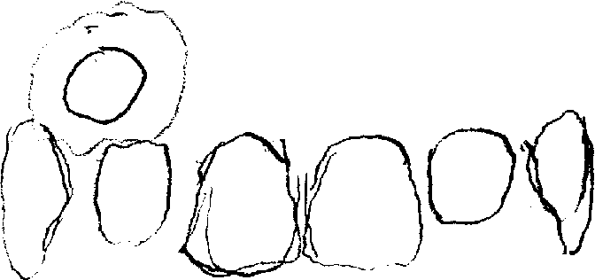

# 雌二醇贴片自制指南

## 版权说明

本页面基于在网络中流传的 stickies.html 进行翻译。
作者：？？？
许可协议：CC0 1.0 Universal
本文衍生内容继续采用 CC0 1.0 Universal 发布。

---

## 制备与使用

*2021 年 1 月至 6 月*

## 引言

我在 2020 年的大部分时间里，都在把雌二醇片剂改造成**一种贴在牙龈上、可缓慢释放的剂型**。

这是一个古怪又耗时的项目，但我对结果很满意，所以觉得应该把它写下来并公开发布。希望有人会觉得它有用，至少也能觉得有趣。

> **不过，请不要照做本文描述的任何事情！**
>
> 如果你或任何人照着这里写的内容做了，而后出了问题，那不是我的责任！认真想一想：根据网上找到的匿名文档去使用实验性的激素剂型，并不合理！

---

## 结果

这个项目的效果**比预期更好**。现在我就是这样使用雌二醇，而且没有停用的打算。我不再像注射时那样头痛。

进行血液检查时，我以这种方式**每天一次使用约 0.375 mg 雌二醇**，检测结果如下：

🕒 停用 HRT 时
- 雌二醇 (E2): 69 pmol/L (19 pg/mL)
- 睾酮 (T): 35 nmol/L (1009 ng/dL)

🕒 给药后 6 小时 (T + 6h)
- 雌二醇 (E2): 434 pmol/L (118 pg/mL)
- 睾酮 (T): 6.9 nmol/L (199 ng/dL)

🕒 给药后 24 小时 (T + 24h)
- 雌二醇 (E2): 272 pmol/L (74 pg/mL)
- 睾酮 (T): 14 nmol/L (404 ng/dL)

期间未使用抗雄激素药物或其他激素。

这些数值并不完美，但它们确实表明贴片有效，而且与医生给我开的口服剂量（**每天 4 mg**）相比，我可以用**小得多的剂量**达到“正常”的血液雌二醇水平。

由于这种配方所需的剂量远低于口服剂量，我每从药房领取一个月份量的片剂，经转换后就能制成**约 10 个月用量的贴片**。后来我略微调整了配方，现在每天使用 0.4 mg；我不觉得效果有明显差别。

贴片没有出现什么真正的问题。最糟的情况只是**偶尔会脱落**，但过去几个月里也只发生过寥寥几次——大约五六次，而且不难处理。

制作它们确实稍微有些费事，但也不算严重。我制作一批 **20 剂**大约需要**半小时**，所需物品也没有特别昂贵或罕见的。

---

## 配方

*可制成 20 片贴片。*

### 原料

- 雌二醇：8 mg
  (4 片 × 2 mg 仿制药片，原样使用)
- 瓜尔胶：1.2 mL 
  (约 1/4 茶匙)
- 水：3.1 mL 
  (约 5/8 茶匙)

这是我最近一段时间一直使用的配方。它可制成 20 剂，**每剂含约 0.4 mg 雌二醇**；贴在牙龈上后，**大约需要 24 小时溶解**。

为了完整起见，我写出了每一步的具体做法。我相信这些操作还有更好的方式；相比基本思路和最终效果，我认为自己处理这些细节的具体方法并没有那么重要。每批制作 20 剂，只是因为我觉得这些原料用量比较容易操作。

### 第 1 步：研磨

**把片剂研磨成细粉。**

我用过干净的陶瓷研钵和研杵；也试过先用刀或分药器把片剂分成小块，再用药瓶把它们压在餐盘上碾碎，药瓶盖的一端朝下。

刚开始压碎时，我喜欢先用一张粘在盘子上的便签纸盖住药片碎块，以防小碎片飞得到处都是。之后移开便签纸，再用药瓶直接在盘子上把碎粒磨细。

**目标状态：** 细、软、均匀的粉末。

### 第 2 步：混合

**量取瓜尔胶，并与药片粉末充分混合。**

这一步量瓜尔胶，以及下一步量水时，我使用的是同一把 **1/8 茶匙量勺**。

**目标状态：** 两种粉末形成平滑、均匀的混合物。

### 第 3 步：加水

**把水加入干性原料中，并极其充分地混合。**

使用研钵和研杵时，我会直接把水加进去，用研杵搅拌、涂抹和研磨混合物。若在盘子上操作，我会像把药片压在盘子上研磨时一样使用药瓶：反复把混合物抹开，再重新聚拢。

**我也用过勺背，甚至直接用手来完成这一步。** 如果面团状混合物太干，我就加一点水；如果太湿，我会继续揉捏、处理一阵，并让它稍微干燥一些。

**目标状态：** 有弹性、光滑、可塑，不会散开，并且能够干净地卷起。

### 第 4 步：分份

**分成大小相等的份量。**

不用模具时，我通常会**把它搓成一条小长条**，再按照所需剂数切分。各份通常会有大有小，因此我会**把最大的一份和最小的一份合在一起，再均分成两份**；如此反复调整，直到没有明显过大或过小的份量。

**目标状态：** 大小相同，或尽可能接近相同的小块面团状混合物。

### 第 5 步：压片

**把各小块塑造成扁平圆片。**

我试过先把它们搓成小球再压扁，也试过**用金属垫圈中央的孔作为模具**。下列尺寸针对的是我最近使用的垫圈孔。

我还发现，这个垫圈孔所容纳的量恰到好处，因此无需预先分份，只要把混合物填满孔，再把圆片推出即可。

不用模具时，可以用**硬币或其他厚度已知的小物件作为参照或深度限位**，以便把各小块压到合适厚度。

贴片太薄，会在干燥时卷曲，而且维持不到完整的 24 小时；太厚，则会显得笨重，并且持续时间远超 24 小时。

**目标状态：** 扁平、圆形、厚度均匀、不透明；**厚度不超过 1.8 mm**（约 70 密耳，即 0.070 英寸；或略小于 5/64 英寸），**直径约 9.5 mm**（约 3/8 英寸）。

### 第 6 步：干燥

**让它们完全干燥。**

我会把贴片放在盘子上过夜，置于不会受打扰的地方。**它们在干燥过程中会明显收缩。** 第二天早晨完全干燥后，我把它们装进药瓶。

**目标状态：** 扁平、圆形、坚硬而有韧性、不透明，比上一步更小；**厚度约 1.1 mm**（约 3/64 英寸），**直径约 6.5 mm**（略大于 1/4 英寸）。

---

## 使用方法

贴片的使用相当简单。早餐后，我会刷牙，然后把一片贴片放在舌头上，再将它推到上牙龈前侧，贴在**犬齿与切牙之间**。每天左右交替。

*示意图：贴片位于牙齿上方的位置。*

贴好贴片后，我会**在大约一小时内避免进食或饮水**。在一天之中，贴片会逐渐吸水，从一小片坚硬圆片变成平滑的凝胶团，最终在**约 24 小时后完全溶解**。

根据我的经验，它们通常能够很好地固定在那里。只有两种情况不止一次导致它们脱落：**贴上后一小时内喝水**，以及**擤鼻涕**，后者与贴上后经过了多久无关。不过我发现，只要小心一点，这两件事都可以做。

我也曾在用力洗脸时不小心把它们挤压变形，还可能各有一次是因为打喷嚏。

它们**没有什么味道**。

在吸水软化之前，它们**偶尔会让人略感不适，或有轻微疼痛**。这种感觉很快就会消失；据我所知，也没有造成实际问题。

有不少活动原本让我担心会有问题，但实际并没有。**进食、饮水、刷牙、漱口、接吻、口交、长时间说话，以及用吸管喝水，似乎都没问题。** 食物似乎也不太会卡在贴片中。

如果贴片在尚未充分吸水前脱落，我通常可以用舌头把它推回原位；**只要暂时不去碰它，它会重新粘住。** 吸水后就比较难重新贴回去，不过仍有可能，尤其是在让表面稍微干燥之后。遇到这种情况，**我通常懒得重新粘贴，而是直接换一片新的。**

我也试过把贴片贴在下牙龈上，但发现它们在那里更容易移位。

我还试过睡前贴，而不是早餐后贴，结果发现它们溶解得没有那么理想，感觉也比白天较早贴上时更厚重。如果把剂量分成早晚两次，情况就没那么糟，因为持续 12 小时的贴片不如持续 24 小时的贴片厚。

虽然我不喜欢把它们用于日常规律给药，但**到了当天较晚的时候，半厚度、持续 12 小时的贴片很实用**：例如需要替换一片，或突然想起自己忘了早晨的剂量时。

我怀疑，自己在处理这些贴片时遇到的种种特点，都是其组成所导致的结果。

---

## 讨论

### 它是什么

我把贴片理解为：雌二醇被包在一片坚韧、致密的瓜尔胶圆片中。里面还有其他物质，例如片剂中的各种辅料，但似乎没有什么值得特别说明的。

雌二醇离开这座“贴片监狱”并进入血液的过程可能相当复杂，而我没有研究它所需的资源。不过，如果必须根据现有知识作出推测，我会说：贴片吸水膨胀，并与口腔内壁摩擦，随着贴片逐渐侵蚀，雌二醇被释放出来，最后通过同一处口腔黏膜进入血液。

学术文献可能会把这类东西称为：**用于雌二醇控释或缓释的颊黏膜黏附给药系统**。这个名称实在太拗口，所以我决定干脆把它们叫作“贴片”。

### 为什么要做

我做这件事并决定把它写下来，有很多原因。

**激素太贵、太难获得，而不同剂型也都有明显缺点。** 对于所有地区、所有使用激素的人而言，这些问题并非全部同时存在，但它们仍是真实的问题。

我想为自己解决其中一些问题，也想展示有哪些可能性，并且朝着一个激素更便宜、更容易获得、使用效果更好的世界迈出一步——即使这一步并不完美。

贴剂在控释方面表现很好，能够让血液中的雌二醇水平保持稳定，因此**较小的每日剂量也能有效**（约 0.1–3 mg/日？）。不过，据我所知，它们**很贵，而且用起来相当麻烦**。

片剂**更便宜、更方便**，但吞服后，雌二醇在进入血液之前很大一部分会先被肝脏代谢，即发生首过效应。因此需要**更高剂量**（约 4–8 mg/日？），会**影响肝脏**，而且会让血液中**雌二醇与其代谢物的比例**偏离人们可能希望看到的状态。

同样的片剂若采用舌下含服，可以避开首过代谢，所以通常认为，同等剂量下它应当比吞服更有效。然而，**这种方式会使血液雌二醇水平迅速升高，又迅速下降。**

这种快速升降意味着，与极其缓慢释放雌二醇的剂型相比，需要更高剂量；但究竟要高多少？（我猜人们用这种方式时，仍然会使用大约 4–8 mg/日。）当血液雌二醇水平如此迅速地升降时，**人们究竟要怎样可靠地测量它，并据此作出决定？**

注射同样可以避开肝脏首过代谢，并使雌二醇水平**以更渐进、因而更可预测和更容易测量的方式升降**。与吞服片剂相比，这也允许使用**更小剂量**。我进行注射时，平均每天约使用 0.5 mg。

但**注射同样很麻烦**；这还没有涉及**注射用雌二醇短缺，以及医生不愿开具处方**的问题。

接下来就是可获得性的问题。

**很多人很难获得激素**，原因可能是费用、当地缺乏服务、不配合甚至直接抱有敌意的医务人员；这种处境糟糕透顶。

有人讨论过在家合成激素的方法，而这原本也是我打算研究的方向。但我想得越多，就越担心这并不是任何人都能做到的事情。**即使我能在家合成雌二醇，我仍然需要对它进行纯化和定量**，而这一切都需要大量专用设备。实在太麻烦。

### 我是怎么做的

有一次我想到，雌二醇在工业生产中既容易制造又便宜，而且世界上已经有大量雌二醇以片剂形式存在。因此，也许我可以通过寻找一种更好的使用方式，**利用已经存在的资源**。

于是我开始考虑制作一种控释剂型。我想，即使效果不如贴剂、最后每天仍需 0.5 mg，也只有医生给我开的每日 4 mg 剂量的八分之一。

这意味着，我手头的雌激素可以制成**八倍数量的剂量，同时让血液雌二醇水平稳定得多**。这个想法足够有趣，值得一试。

我很早就决定，最终做出来的东西必须是**几乎任何人都能完成的**：不用奇怪的原料，不用专用设备，也不能昂贵。

这就是我最终选择瓜尔胶的原因。它**便宜、随处可以买到，而且人们本来就经常把它吃进肚子里**。

这也是配方中不使用秤的原因。并非每个人都有足够精密的秤，可以称量这里所用的微小原料量。最终得到的配方，**复杂程度不会超过制作新鲜意大利面**，而且只需要常见的家用物品即可完成。

2019 年末，在完成大量资料研究并确定想尝试的方向后，我用 2020 年的大部分时间摸索这个配方，并在自己身上进行测试。**自 2020 年 3 月以来，我没有通过任何其他方式使用过雌二醇。**

一开始，我每次只制作两剂：把雌二醇片分开，加入一点根本无法准确量取的瓜尔胶，再加可能不到十几滴水。随着时间推移，我逐渐更清楚目标状态，便扩大了每批规模：一方面更方便，另一方面是使用较大、较容易测量的原料量，以提高一致性。

起初我每天大约使用 0.25 mg，后来尝试每天 0.5 mg，但感觉药效有些过强、来得也太突然。

这让我有点害怕，因为**当时我无法进行任何血液检查**，完全不知道检测数值是否严重超出范围。因此，在拿到第一次血检结果之前，我又降回每天 0.25 mg。（既然谈到剂量，**值得说明的是，我的体型比较小。**）

根据检测数值，我决定把剂量提高 50%；再次进行血液检查后，数值也大致改善了相同比例。此后我不再调整剂量，主要转而微调制作流程和贴片尺寸。

**我很希望能做更多血液检查**，但考虑到当时的 COVID 疫情，以及我已经达到血液雌二醇目标水平，再去检测似乎有些不必要，因此现有数据比我希望的少。

等以后能够再次进行血液检查时，我可能会重新尝试每天 0.5 mg。根据现在掌握的信息，我认为这可能是一个合理剂量。

每次改变配方或流程时，**我通常会维持新方案约两周，以了解它造成的影响**，而且**每次只改变一个因素**。

我用日志记录每天的情况，包括批次、贴片的尺寸和形状、贴上的时间，以及完全溶解的时间。这个过程非常适合把持续时间调整到 24 小时，但除此之外，我没有获得什么特别惊人的发现。

在每批总量和直径固定时，**增加雌二醇会让贴片的药效更强；增加瓜尔胶会让贴片更厚，从而持续更久。**

以后再次尝试每天 0.5 mg 时，我打算直接在配方中加入第 5 片药，看看贴片是否仍能持续 24 小时，再按需要继续调整。

### 未来与结语

**我会继续改进配方**，让制作过程更快、更容易；不过，我对目前的结果已经很满意。

我也会花些时间研究一个类似配方，只是把雌二醇换成孕酮。我做过一次快速测试：把微粉化孕酮胶囊中的内容物与瓜尔胶混合，再加入极少量水使其吸水，放置过夜干燥，制成的东西看起来很有希望。

不过，**我不想为了完成这项工作而推迟发布本文**。

目前就写到这里。**感谢阅读，请保重。**

---

## 致谢

感谢我的朋友们在校对、编辑和设计方面提供的所有帮助。我不确定没有这些帮助时自己是否能完成全文；即使能够完成，质量也绝不会像现在这样好。

也感谢那些研究颊黏膜黏附给药系统的研究者，尤其是研究天然聚合物系统的研究者。我在开始设计自己的配方前阅读了他们的工作。那些论文让我看到可能达到怎样的效果，也激励我尝试寻找自己的方法。

《雌二醇贴片：制备与使用》采用 [CC0 1.0 通用公共领域贡献声明](http://creativecommons.org/publicdomain/zero/1.0) 发布。可以自由分享、打印或下载本文件。