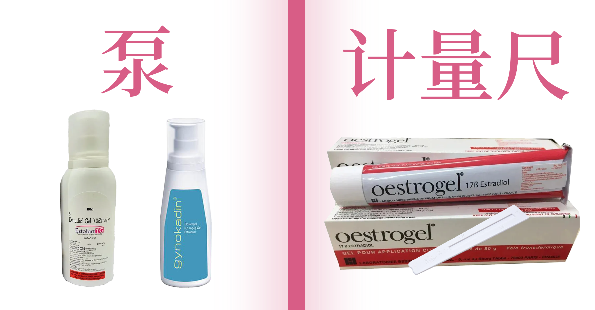

# HRT入门

尽管本站的内容已经尽可能的简短，但可能还会有人不想看下去。
那么您可以点击这个链接：[我不想系统性的学习 HRT，直接给我简单明确的用药方案](./hrt-quickstart)
本站不推荐这么做，但这总比按口口相传的经验随意用药要好。
本站仍然建议您对 HRT 建立一个系统性的认知。

## 结论

MtF HRT 通常由两类药物组成：

```text
抑制睾酮（色普龙、螺内酯 | 二选一）
+
补充雌激素（雌二醇片补佳乐、雌二醇凝胶 | 二选一）
```

两者通常需要同时使用。只补雌激素、不压睾酮，效果会大打折扣。

下面分别介绍最常见的几种药物。

---

## 抗雄激素（压睾酮）

作用：让身体停止/减少分泌睾酮，或阻断睾酮的作用。这是 HRT 的"地基"，没压住睾酮，雌激素往往压不过内源性睾酮。

### 醋酸环丙孕酮（色普龙 / CPA）

- **怎么吃**：口服，每天一次
- **每日剂量区间**：`10 ~ 12.5 mg`
- **起效时间**：数周内睾酮明显下降
- **要注意**：
  - 不是"越多压得越快"，超量不会让你更快变化，只会增加副作用（肝功能、情绪、泌乳素升高）风险
  - 需定期查肝功能
  - 不要自行叠加大剂量
- **副作用与风险**：可能导致情绪波动、抑郁、泌乳素升高、性欲下降和肝功能异常。长期或高剂量使用会增加脑膜瘤风险，因此已在欧洲多国被限制适应症并要求使用最低有效剂量。

### 螺内酯（安体舒通）

- **怎么吃**：口服，通常分2次
- **每日剂量区间**：`100 ~ 400 mg`
- **起效时间**：比 CPA 慢，需要数周到数月
- **要注意**：
  - 本身是利尿剂，会增加排尿、口渴
  - 需定期查血钾，肾功能不好的人格外要小心
  - 单用螺内酯抗雄效果通常弱于 CPA，通常需要配合雌激素达到最佳抗雄效果
  - **不要同时吃高钾食物，否则可能导致高钾血症！**
- **副作用与风险**：可能导致尿频、口渴、低血压、高血钾、电解质紊乱和疲劳乏力。

> **CPA vs 螺内酯怎么选**：CPA 抗雄效果更强、起效更快，但更容易引起情绪低落、抑郁倾向和泌乳素升高，需要更频繁地关注肝功能。螺内酯对情绪的影响相对小，但作为利尿剂会导致脱水、电解质紊乱（尤其血钾）和血压下降，夏天大量出汗或本身肾功能不好的人风险更高，单用抗雄效果也通常弱于 CPA。

---

## 雌激素

作用：建立/维持女性化的第二性征。分两种给药方式：**口服**和**透皮（凝胶）**，吸收方式不同，剂量不能直接互相套用。

### 雌二醇片（补佳乐 / Progynova）

- **怎么吃**：舌下含服。把药片放在舌头下面，含到完全溶解再咽下，不要直接吞服。这样一部分雌二醇绕过肝脏首过代谢，直接进入血液，起效更快、血药浓度波动更小，效率高于直接吞服
- **每日剂量区间**：`2 ~ 6 mg`，通常分2次，每次含服
- **要注意**：
  - 含服吸收效率比吞服高，同样的毫克数，含服的实际血药浓度更高，不要把吞服的剂量经验直接套到含服上
  - 含服时不要同时喝水或进食，等药片完全溶解
- **副作用与风险**：可能导致血栓风险升高。

### 雌二醇凝胶（爱斯妥 / Estrogel、Oestrogel）

透皮吸收，避开口服的肝脏首过代谢，对肝功能影响更小，血栓风险更低，是越来越多人优先选择的剂型。

**先分清楚你拿到的是哪种**：



| 类型 | 外观 | 怎么用 |
|---|---|---|
| **计量尺（带刻度的量具）** | 一个带刻度尺的小工具，挤一定长度的凝胶到量具上 | 挤到指定刻度，涂抹在皮肤上 |
| **泵装（按压式）** | 瓶口是按压泵头，按一下出一个固定剂量 | 直接按压相应"泵数"涂抹 |

**怎么分辨自己手上是哪种**：看瓶子开口——如果有独立的刻度量具/量尺，是计量尺装；如果瓶身自带可按压的泵头，按一下出一下，是泵装。两种不能按同一个数字换算，因为"一计量尺"和"一泵"出胶量不同。

- **每日用量**：
  - 计量尺装：`1 ~ 2 计量尺`
  - 泵装：`2～4 泵`
- **怎么涂**：通常涂在大腿内侧或手臂，每天轮换部位，涂抹后等待干透（一般几分钟）再穿衣服，当天尽量不要让该部位长时间泡水
- **要注意**：涂抹后一段时间内避免让别人（尤其儿童、孕妇）直接皮肤接触涂抹部位，凝胶会蹭到对方身上
- **副作用与风险**：可能增加血栓风险（低于口服雌激素）。

---

## 雌二醇本身的抗雄作用

很多人以为"雌激素只负责女性化，压睾酮全靠抗雄药"，但其实雌二醇本身就有压睾酮的作用。

也就是说：**只要雌二醇血药浓度足够高，本身就能压低内源性睾酮**。但单靠雌二醇压睾酮容易压不住，个体差异很大，仍建议同时用抗雄药+雌激素，否则有雌雄双高风险。

---

## 压不住睾酮时，不一定是抗雄药不够

很多人的第一反应是：

> 睾酮没压下去 → 抗雄药加量

但实际上，**优先考虑提高雌二醇到合理范围，往往比一味增加抗雄药更有效。**

雌二醇本身就会通过 HPG 轴负反馈抑制 LH 和 FSH，从源头减少睾丸分泌睾酮。

也就是说：

```text
提高雌二醇
↓
LH下降
↓
睾丸减少分泌睾酮
↓
睾酮进一步下降
```

因此：

- 雌二醇偏低 → 睾酮压不住
- 雌二醇达到合理水平 → 睾酮自然下降

这比单纯不断增加抗雄药更符合身体本来的调节机制。

### 为什么不优先无限加抗雄药

因为抗雄药的副作用是剂量相关的。

例如：

- CPA 剂量越高，泌乳素升高、情绪低落、肝功能异常风险越高
- 螺内酯剂量越高，脱水、低血压、高血钾风险越高

而当雌二醇本身还没有达到足够水平时，继续增加抗雄药往往收益有限，却会明显增加副作用。

---

## "雌雄双高"和"雌雄双低"

|状态|含义|怎么理解|
|--------|---------------------|---------------------------|
|**雌雄双高**|雌二醇很高，但睾酮没有被压下去，同时也很高|抗雄效果不够，睾酮压制失败，雌激素和睾酮在体内"打架"|
|**雌雄双低**|雌二醇和睾酮都偏低|雌激素补充也不够，身体处于一种"两头都缺"的低激素状态|

### 可能出现的体验

#### 雌雄双高

- 女性化进展缓慢或停滞
- 油脂分泌仍然较多
- 皮肤改善不明显
- 毛发生长速度仍然较快
- 性欲没有明显下降
- 情绪波动较大

#### 雌雄双低

- 容易疲劳
- 没精神、缺乏动力
- 情绪低落
- 注意力下降
- 性欲明显降低甚至消失
- 运动能力下降
- 对寒冷更敏感

### 为什么会出现雌雄双高

- 抗雄药剂量不够、或者个体对该药物反应弱(比如螺内酯本身抗雄效力有限，有些人吃到上限睾酮还是压不住)

雌雄双高的问题是:**即使雌二醇数值看起来很"达标"，只要睾酮没压下去，女性化效果也会被持续抵消**，因为雄激素一直在对抗雌激素的作用。这种情况不是"加雌激素"能解决的，而是要回头检查抗雄是不是真的有效，通常需要换药或调整抗雄剂量。

### 为什么会出现雌雄双低

- 雌激素补充剂量不够
- 抗雄药把睾酮压得很低，但雌激素没跟上，导致两边都低

雌雄双低本身不会带来"双高"那种激素互相对抗的问题，但长期处于双低状态，相当于身体两种性激素都不够，可能出现类似"激素缺乏"的不适(疲劳、骨密度下降风险、情绪波动等)，需要的是把雌激素剂量往上调，而不是继续压低睾酮。

## 孕激素（P）有必要吗？

目前证据有限。
部分人会使用黄体酮，但其对乳房发育和女性化效果的帮助尚无明确共识。
不建议新人在 HRT 初期自行叠加孕激素。

---

## HRT 与生育能力

HRT 可能导致生育能力下降。
部分人在停药后可恢复，但无法保证一定恢复。
如果未来有生育需求，建议开始 HRT 前进行精子保存。

---

## 不推荐使用的雌激素

- 炔雌醇
- 己烯雌酚
- 结合雌激素

原因：

- 血栓风险更高
- 已被现代跨性别医疗逐渐淘汰

---

## 常见误区

### 不要照抄群友的方案

别人的剂量是根据他自己的血药浓度调出来的，不是通用模板。同样的剂量，两个人的雌二醇血药浓度可能差几倍。

### HRT 不是越多越好

超过身体能利用的剂量，多出来的部分不会变成"更快更女性化"，只会变成肝脏和肾脏的负担，以及更高的血栓、泌乳素升高等风险。

### 色普龙不是糖豆

CPA 对情绪、肝功能、泌乳素都有实际影响，不是"吃不死人就随便吃"的药。

### HRT 不是魔法

身体的变化速度和上限是个体差异极大的过程，剂量调高不会让你"跳过"这个过程。

---

## 风险控制

1. 开始用药后，如果有医疗条件，定期复查激素六项（雌二醇、睾酮、泌乳素等）和肝肾功能、血钾（如果在吃螺内酯）
2. 如果出现剧烈头痛、单侧肢体肿痛、视觉异常等症状，立刻就医——这可能是血栓相关的紧急情况