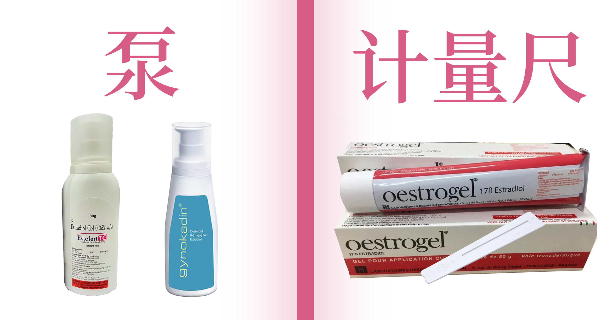

# HRT入门

尽管本站的内容已经尽可能的简短，但可能还会有人不想看下去。
那么您可以点击这个链接：[我不想系统性的学习 HRT，直接给我简单明确的用药方案](./hrt-quickstart)
本站不推荐这么做，但这总比按口口相传的经验随意用药要好。
本站仍然建议您对 HRT 建立一个系统性的认知。

## 结论

MtF HRT 有两种思路：

```text
A：雌二醇 + 抗雄药（色普龙、螺内酯 | 二选一）
B：雌二醇单药，用雌二醇本身抑制睾酮
```

多数方案使用雌二醇加抗雄药；如果雌二醇单药已经把睾酮稳定压到目标范围，就不需要额外使用抗雄药。[^hembree2017][^misakian2025]

下面分别介绍最常见的几种药物。

---

## 抗雄激素（压睾酮）

作用：让身体停止/减少分泌睾酮，或阻断睾酮的作用。这是 HRT 的"地基"，没压住睾酮，雌激素往往压不过内源性睾酮。

### 醋酸环丙孕酮（色普龙 / CPA）

- **用法用量**：每天口服一次，`10 ~ 12.5 mg`。[^soc8][^defreyne2021]
- **要注意**：
  - 不是"越多压得越快"，超量不会让你更快变化，只会增加副作用
  - 需定期查肝功能
  - 不要自行叠加大剂量
- **副作用**：疲劳、性欲下降、情绪低落、泌乳素升高和肝酶升高。脑膜瘤风险随累计剂量增加，应使用最低有效剂量。[^wilson2020][^ema2020]

10 mg CPA 对睾酮的抑制效果与更高剂量相当；脑膜瘤风险随累计剂量增加，因此不应为了“压得更快”而增加剂量。[^defreyne2021][^ema2020]

### 螺内酯（安体舒通）

- **用法用量**：每天口服 `100 ~ 300 mg`，通常分 2 次。[^soc8]
- **要注意**：
  - 本身是利尿剂，会增加排尿、口渴
  - 需定期查血钾，肾功能不好的人要格外小心
  - 单用螺内酯抗雄效果通常弱于 CPA，通常需要配合雌激素达到最佳抗雄效果
  - 不要自行补钾或使用含钾盐替代品；正常饮食不需要一律禁食高钾食物，但肾功能异常或已经高钾时应按医嘱限制
- **副作用**：尿频、口渴、低血压、疲劳和高钾血症；脱水时可能加重低血压和肾功能异常。[^aldactone]

使用螺内酯时应监测血钾和肾功能。[^hembree2017]

> **CPA vs 螺内酯怎么选**：CPA 抑制睾酮更直接，但需要关注情绪、泌乳素、肝功能和累计剂量相关的脑膜瘤风险。螺内酯没有 CPA 的脑膜瘤风险，但会利尿、降低血压并可能升高血钾，使用时检查血钾和肾功能。[^defreyne2021][^wilson2020][^aldactone]

---

## 雌激素

作用：建立/维持女性化的第二性征。分两种给药方式：**口服**和**透皮（凝胶）**，吸收方式不同，剂量不能直接互相套用。

### 雌二醇片（补佳乐 / Progynova）

- **怎么吃**：舌下含服。把药片放在舌头下面，含到完全溶解再咽下，不要直接吞服。这样一部分雌二醇绕过肝脏首过代谢，直接进入血液，吸收更快、峰值更高，但血药浓度波动也更明显[^doll2022]
- **每日剂量区间**：`2 ~ 6 mg`，通常分2次，每次含服[^soc8][^doll2022]
- **要注意**：
  - 含服吸收效率比吞服高，同样的毫克数，含服的实际血药浓度更高，不要把吞服的剂量经验直接套到含服上
  - 含服时不要同时喝水或进食，等药片完全溶解[^doll2022]
- **副作用**：可能出现乳房胀痛、头痛、恶心；雌激素共同的主要严重风险是静脉血栓。舌下含服会产生较高峰值和明显波动，并不能据此认定血栓风险已经消失。[^doll2022][^soc8]

### 雌二醇凝胶（爱斯妥 / Estrogel、Oestrogel）

透皮吸收，避开口服的肝脏首过代谢，对肝功能影响更小，血栓风险更低，是越来越多人优先选择的剂型。[^soc8]

**先分清楚你拿到的是哪种**：



| 类型 | 外观 | 怎么用 |
|---|---|---|
| **计量尺（带刻度的量具）** | 一个带刻度尺的小工具，挤一定长度的凝胶到量具上 | 挤到指定刻度，涂抹在皮肤上 |
| **泵装（按压式）** | 瓶口是按压泵头，按一下出一个固定剂量 | 直接按压相应"泵数"涂抹 |

**怎么分辨自己手上是哪种**：看瓶子开口——如果有独立的刻度量具/量尺，是计量尺装；如果瓶身自带可按压的泵头，按一下出一下，是泵装。常见的 Oestrogel 计量尺每尺含雌二醇 `1.5 mg`，EstroGel 泵装每泵含 `0.75 mg`，两者不能按同一个数字换算。[^oestrogelmeasure][^oestrogel]

- **每日用量**：计量尺装 `1 ~ 2 计量尺`；泵装 `2～4 泵`。[^soc8][^oestrogelmeasure][^oestrogel]
- **怎么涂**：每日一次，涂在清洁、干燥、完整的大腿内侧或手臂皮肤，薄涂并轮换部位；约 5 分钟干燥后再穿衣服，涂后至少 1 小时避免清洗该处或使用其他皮肤产品。[^oestrogel]
- **要注意**：避免涂在乳房、外阴或破损皮肤；涂抹后至少 1 小时内避免让别人（尤其儿童）直接接触涂抹部位。[^oestrogel]
- **副作用**：可能出现乳房胀痛、头痛和涂抹部位瘙痒、皮疹或刺激；未干前可能转移到接触者皮肤。透皮雌二醇的血栓风险低于口服雌激素。[^estrogel][^soc8]

---

## 雌二醇本身的抗雄作用

很多人以为"雌激素只负责女性化，压睾酮全靠抗雄药"，但其实雌二醇本身就有压睾酮的作用。

也就是说：**只要雌二醇血药浓度足够，本身就能压低内源性睾酮**。2025 年一项美国多中心研究中，未切除性腺的雌二醇注射单药使用者，其睾酮中位数为 18 ng/dL，已经处于指南目标范围。[^misakian2025]

### 不使用抗雄药：雌二醇单药（强雌抗雄）

“强雌抗雄”是**只使用雌二醇，依靠雌二醇对 HPG 轴的负反馈抑制睾酮**。

```text
只使用雌二醇
↓
用药稳定后检查 E2 和 T
↓
T < 50 ng/dL：不需要加抗雄药
T 仍偏高：调整雌二醇方案，或加入抗雄药
```

- 注射雌二醇的单药抑制证据最直接；透皮雌二醇在吸收充分时也能抑制睾酮。[^misakian2025]
- 目标仍是 **E2 100～200 pg/mL、T <50 ng/dL**，不要为了单药而追求超生理的 E2。[^hembree2017][^soc8]
- 单药已经压住 T 时，额外添加 CPA 或螺内酯不会让女性化“翻倍”，只会增加另一种药物的副作用来源。

---

## 压不住睾酮时，不一定是抗雄药不够

很多人的第一反应是：

> 睾酮没压下去 → 抗雄药加量

但实际上，**优先考虑提高雌二醇到合理范围，往往比一味增加抗雄药更有效。**

雌二醇本身就会通过 HPG 轴负反馈抑制 LH 和 FSH，从源头减少睾丸分泌睾酮。

也就是说：

```text
提高雌二醇
↓
LH下降
↓
睾丸减少分泌睾酮
↓
睾酮进一步下降
```

因此：

- 雌二醇偏低 → 睾酮压不住
- 雌二醇达到合理水平 → 睾酮自然下降

这比单纯不断增加抗雄药更符合身体本来的调节机制。

### 为什么不优先无限加抗雄药

因为抗雄药的副作用是剂量相关的。

例如：

- CPA 累计剂量越高，脑膜瘤风险越高；增加剂量不会进一步改善已经充分的睾酮抑制[^defreyne2021][^ema2020]
- 螺内酯剂量越高，利尿、低血压和高血钾风险越值得关注[^aldactone]

而当雌二醇本身还没有达到足够水平时，继续增加抗雄药往往收益有限，却会明显增加副作用。

---

## "雌雄双高"和"雌雄双低"

|状态|含义|怎么理解|
|--------|---------------------|---------------------------|
|**雌雄双高**|雌二醇很高，但睾酮没有被压下去，同时也很高|抗雄效果不够，睾酮压制失败，雌激素和睾酮在体内"打架"|
|**雌雄双低**|雌二醇和睾酮都偏低|雌激素补充也不够，身体处于一种"两头都缺"的低激素状态|

### 可能出现的体验

#### 雌雄双高

- 女性化进展缓慢或停滞
- 油脂分泌仍然较多
- 皮肤改善不明显
- 毛发生长速度仍然较快
- 性欲没有明显下降
- 情绪波动较大

#### 雌雄双低

- 容易疲劳
- 没精神、缺乏动力
- 情绪低落
- 注意力下降
- 性欲明显降低甚至消失
- 运动能力下降
- 对寒冷更敏感

### 为什么会出现雌雄双高

- 抗雄药剂量不够、或者个体对该药物反应弱(比如螺内酯本身抗雄效力有限，有些人吃到上限睾酮还是压不住)

雌雄双高的问题是:**即使雌二醇数值看起来很"达标"，只要睾酮没压下去，女性化效果也会被持续抵消**，因为雄激素一直在对抗雌激素的作用。这种情况不是"加雌激素"能解决的，而是要回头检查抗雄是不是真的有效，通常需要换药或调整抗雄剂量。

### 为什么会出现雌雄双低

- 雌激素补充剂量不够
- 抗雄药把睾酮压得很低，但雌激素没跟上，导致两边都低

雌雄双低本身不会带来"双高"那种激素互相对抗的问题，但长期处于双低状态，相当于身体两种性激素都不够，可能出现类似"激素缺乏"的不适(疲劳、骨密度下降风险、情绪波动等)，需要的是把雌激素剂量往上调，而不是继续压低睾酮。

---

## HRT 与生育能力

HRT 可能导致生育能力下降。
部分人在停药后可恢复，但无法保证一定恢复。
如果未来有生育需求，建议开始 HRT 前进行精子保存。[^soc8]

---

## 不推荐使用的雌激素

- 炔雌醇
- 己烯雌酚
- 结合雌激素

原因：

- 血栓风险更高
- 已被现代跨性别医疗逐渐淘汰[^hembree2017][^soc8]

---

## 常见误区

### 不要照抄群友的方案

别人的剂量是根据他自己的血药浓度调出来的，不是通用模板。同样的剂量，两个人的雌二醇血药浓度可能差几倍。

### HRT 不是越多越好

超过身体能利用的剂量，多出来的部分不会变成"更快更女性化"，只会变成肝脏和肾脏的负担，以及更高的血栓、泌乳素升高等风险。

### 色普龙不是糖豆

CPA 对情绪、肝功能、泌乳素都有实际影响，不是"吃不死人就随便吃"的药。

### HRT 不是魔法

身体的变化速度和上限是个体差异极大的过程，剂量调高不会让你"跳过"这个过程。

---

## 风险控制

1. 开始用药后的第一年每 3 个月复查雌二醇、睾酮及相关安全指标；稳定后每年复查 1～2 次。使用螺内酯时同时检查血钾和肾功能。[^hembree2017][^soc8]
2. 如果出现剧烈头痛、单侧肢体肿痛、视觉异常等症状，立刻就医——这可能是血栓相关的紧急情况[^soc8]

[^hembree2017]: Hembree WC, Cohen-Kettenis PT, Gooren L, et al. [Endocrine Treatment of Gender-Dysphoric/Gender-Incongruent Persons: An Endocrine Society Clinical Practice Guideline](https://doi.org/10.1210/jc.2017-01658). *J Clin Endocrinol Metab.* 2017;102(11):3869–3903. doi:10.1210/jc.2017-01658.

[^soc8]: Coleman E, Radix AE, Bouman WP, et al. [Standards of Care for the Health of Transgender and Gender Diverse People, Version 8](https://doi.org/10.1080/26895269.2022.2100644). *Int J Transgend Health.* 2022;23(Suppl 1):S1–S259. doi:10.1080/26895269.2022.2100644.

[^misakian2025]: Misakian AL, Kelley CE, Sullivan EA, et al. [Injectable Estradiol Use in Transgender and Gender-Diverse Individuals throughout the United States](https://doi.org/10.1210/clinem/dgaf015). *J Clin Endocrinol Metab.* 2025;110(9):e2898–e2907. doi:10.1210/clinem/dgaf015.

[^doll2022]: Doll E, Gunsolus I, Thorgerson A, et al. [Pharmacokinetics of Sublingual Versus Oral Estradiol in Transgender Women](https://doi.org/10.1016/j.eprac.2021.11.081). *Endocr Pract.* 2022;28(3):237–242. doi:10.1016/j.eprac.2021.11.081.

[^defreyne2021]: Defreyne J, Vanwonterghem Y, Collet S, et al. [Toward a Lowest Effective Dose of Cyproterone Acetate in Trans Women: Results From the ENIGI Study](https://doi.org/10.1210/clinem/dgab427). *J Clin Endocrinol Metab.* 2021;106(10):e3936–e3945. doi:10.1210/clinem/dgab427.

[^ema2020]: European Medicines Agency. [Restrictions in use of cyproterone due to meningioma risk](https://www.ema.europa.eu/en/news/restrictions-use-cyproterone-due-meningioma-risk-0). 2020.

[^wilson2020]: Wilson LM, Baker KE, Sharma R, et al. [Effects of antiandrogens on prolactin levels among transgender women on estrogen therapy: A systematic review](https://doi.org/10.1080/15532739.2020.1819505). *Int J Transgend Health.* 2020;21(4):391–402. doi:10.1080/15532739.2020.1819505.

[^aldactone]: U.S. Food and Drug Administration. [Aldactone (spironolactone) tablets: Prescribing Information](https://www.accessdata.fda.gov/drugsatfda_docs/label/2020/012151s077lbl.pdf). 2020.

[^estrogel]: U.S. Food and Drug Administration. [EstroGel 0.06% (estradiol gel): Prescribing Information](https://www.accessdata.fda.gov/drugsatfda_docs/label/2024/021166s019lbl.pdf). 2024.

[^oestrogel]: Besins Healthcare (UK) Ltd. [Oestrogel Pump-Pack 750 micrograms/actuation Gel: Summary of Product Characteristics](https://www.medicines.org.uk/emc/product/353/smpc). Updated 2025.

[^oestrogelmeasure]: Singapore Health Sciences Authority. [Oestrogel 0.06%: Product Information](https://www.ndf.gov.sg/about-drugs/product-information/sin06503p/). Each graduated measure contains 1.5 mg estradiol.
